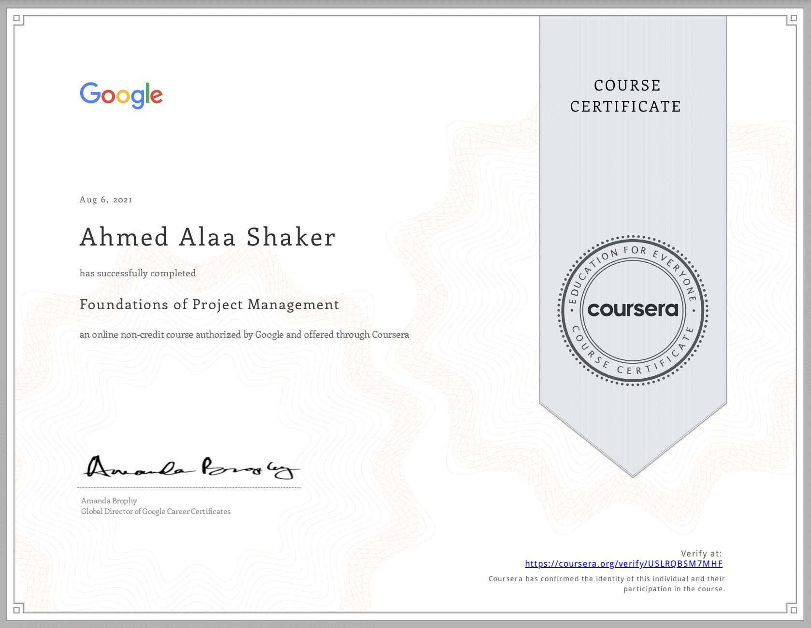

# Course 1: Foundations of Project Management 

You can check the certificate from [here](https://coursera.org/share/688162fa1151071888278a0bb98e6dae)

# Table of Content:
- [Week 1: Embarking on a career in project management](d#c1-w1)
    - [Getting started with the program](d#c1-w1-getting-started)
    - [Understanding the basics of project management](d#c1-w1-basics-pm)
    - [Learning about careers in project management](d#c1-w1-pm-careers)
- [Week 2: Becoming an effective project manager](d#c1-w2)
    - [Exploring how a project manager adds value](d#c1-w2-how-pm-add-value)
    - [Learning more about project manager roles](d#c1-w2-pm-roles)
    - [Acquiring the core skilles of a successful project manager](d#c1-w2-core-skills)
- [Week 3: The project management life cycle and methodologies](d#c1-w3)
    - [Understanding the project life cycle](d#c1-w3-project-life-cycles)
    - [Analyzing the different project phases](d#c1-w3-project-phases)
    - [Comparing project management life cycle and methodologies and approaches](d#c1-w3-pm-methodologies)
- [Week 4: Organizational structure and culture](d#c1-w4)
    - [Understanding organizational structure](d#c1-w4-org-structure)
    - [Understannding the impact of organizational culture](d#c1-w4-org-culture)
    - [Understanding change management](d#c1-w4-change-management)
    - [Optional - Pusuing your new career](d#c1-w4-new-career)

## Week 1: Embarking on a career in project management 
You will learn how the program is structured, what project management is and what a project manager does, how to apply your skills from previous work experience to project management roles, what types of project management roles you could pursue after completing this certificate, and how to search for those positions.

**Learning Objectives**
- Relate the skills and responsibilities of a project manager necessary to achieve success on the job.
- Define project management and describe what constitutes a project.
- Explain project management roles and responsibilities across a variety of industries.
- Detail and relate project management skills to project management and its value to business.
- Determine how this program will help prepare you for a career in project management.
- Explain the Project Management certificate program structure and course functionality.
### Getting started with the program 
**Project Management** is the app;ication of knowledge, skills, tools and techniques to meet the project requirements and achieve the desired outcome
During this program you will learn:
- Project management fundamentals
- Goals, objectives and deliverables
- Risk management
- Team dynamics
- Project Management Methodologies:
    - Agile
    - Scrum
    - Waterfall
- Data-driven decision making
- Tools
    - Kanban
    - Asana

### Understanding the basics of project management 
**Project**
- A unique endeavor, and usually includes a set of unique deliverables
- A temporary pursuit; it has a defined beginning and end

Project management is valuable to businesses because it helps ensure that a project delivers the expected outcomes both ontime and within budget

Poor project management can affect to real damage for the organisations
According to recent survey by the Project Management Institute:
- 48% of projects miss delivery dates
- 43% of project miss budget targets
- 31% of projects fail to meet an organization's goals

**Program Manager**: Someone who manage multiple projects for specifiec products, teams or programs

**What does a project manager do?**
- Planning and organizing
- Managing tasks
- Budgeting
- Controlling costs and other factors

Project Manager responsibilities can vaies depending on the project, the industry and the company they working in

In real life you may faced some situations that required project management skils for example:
- Organizing family event
- Planning for a relocation

### Learning about careers in project management 
In 2017, a study by the Project Management Institute found that by the year 2027, employers will need 87.7 million people filling project management aligned roles.
According to that same study, the industries with the most growth are:
- Mannufacturing and Construction
- Information services and publishing
- Management and professional services
- Finance and insurance
- Utilities
- Oil and Gas

The skills you learned on one industry can be used with another industries
**Types of Jobs that you may be qualified for after completing this program**:
- Program Manager
- Operations assistant
- Operation Manager
- Project Coordinator
- Program assistant
- Project Support Specialist
...

Your responsibilities might change depending on the type of company you choose.
For example, the workload and specific tasks at a small agency will be different from those at Google

#### Explore project management roles
You are about to start on your path to securing a high-demand position as a project manager. One of the greatest benefits of the project management field is that it encompasses a wide variety of positions across numerous industries. As you complete this certification, you will acquire skills that will qualify you for various job titles. Here, we will discuss some different project management job categories and some common roles within those categories. We’ll also describe the great potential for career progression in project management, from entry-level positions to senior program management roles, and the many opportunities in between!  

##### Project management job categories and common roles 
-  **Introductory-level project management roles**
    Entry-level project management positions are a great opportunity to get your foot in the door and learn the ins and outs of how a company operates and manages projects. The lessons you learn from these experiences are extremely valuable to your growth in project management. Some entry-level project management positions include:
    - **Junior Project Manager**: Performs all aspects of being a project manager alongside a more experienced professional.
    - **Project Administrator**: Assists the rest of the project team with administrative tasks. 
    - **Project/Program Assistant**: Supports team members working on a project and offers administrative support. May perform research or create training documents along with other jobs as assigned by program leaders.
    - **Project/Program Coordinator**: Participates in hands-on project work and administrative tasks. Works under a project manager to make sure projects are completed on time and within budget.
    - **Project Support Specialist**: Works alongside a project manager and team members to oversee assigned projects. May also be responsible for training and developing employees to perform designated tasks.

- **Traditional project management roles**
    Once you have gained some experience in introductory-level positions, you can explore traditional project management roles, such as:
    - **Project Manager**: Responsible for the initiating, planning, executing, monitoring, and closing of a project. Includes industry-specific titles like IT project manager, construction project manager, or engineering project manager, which utilize skills that are transferable among industries.
    - **Project Analyst**: Moves a project along by sharing information, providing support through data analysis, and contributing to strategy and performance. 
    - **Project Leader/Director**: Drives core decision-making and sets the direction for the project. Usually knowledgeable about the product or deliverable. 
    - **Project Controller**: Primarily responsible for project planning. You are likely to see this job title in industries like engineering and construction.
    - **Technical Project Manager**: Conducts project planning and management for identified goals within a company. Ensures that projects are completed to the requirements within a defined time frame and budget.
    - **Project Management Office (PMO) Analyst**: Manages the progress of complex projects to ensure timely execution and completion. 

- **Program and portfolio management roles**
    As you have learned, project managers are responsible for the day-to-day management of projects. They shepherd projects from start to finish and serve as a guide for their team. Project managers must apply the right tools, techniques, and processes to complete the project successfully, on time, and within budget. 

    After you have carried out projects successfully and feel you are ready for a step up in responsibility, a program manager position may be the next step for you. While a project is one single-focused endeavor, a **program** is a collection of projects. Program managers are responsible for managing many projects. At Google, all project managers are called program managers because they manage multiple projects simultaneously. 

    Successfully implementing programs as a program manager can eventually make you a great fit for more senior positions, such as a senior program manager or a portfolio manager. A **portfolio** is a collection of projects and programs across an entire organization. Portfolio managers are responsible for portfolios of projects or programs for one client. Over the course of your career, you might progress from project manager to program manager to portfolio manager roles.

    While project, program, and portfolio managers hold different types and levels of responsibility, they are all project managers. In Course 4 of this certificate program, you will learn more about differentiating projects, programs, and portfolios.

    
    - **Program managers**: Manage a group of projects that are related or similar to one another and handle the coordination of these projects. They facilitate effective communication between individual project managers and provide support where necessary. They also help create and manage long-term goals for their organization.

    - **Portfolio managers**: Responsible for managing a group of related programs within the same organization. They coordinate various programs in order to ensure they are on track and that the organization is meeting its strategic initiatives. Portfolio managers look at all projects and programs within the organization and prioritize work as necessary. 

- **Operational management roles**
    In operational management roles, you will get the opportunity to experience several different departments and how they interact and operate. Operational management roles allow you to work alongside peers and management from various business segments, giving you an appreciation for what each segment does on a daily basis. Key elements of project management include making sure a project is on budget and on schedule. This course, and your experience as a project manager, will give you the tools to be able to apply those skills to running a business. Some operational management positions include:
    - **Operations Analyst**: Manages and coordinates research, investigates workflows, creates business procedures, and recommends changes to improve the project and company. 
    - **Operations Manager**: Oversees strategic decision-making and rolls out plans of action based on financial, schedule, and resource reporting. 
    - **Chief Operating Officer**: Responsible for overseeing the day-to-day administrative and operational functions of a business.

- **Agile roles**
    We will discuss the Agile project management approach in depth later, but here are a couple of the positions you may see that are related to that approach:
    - **Scrum Master**: Coordinates and guides the Scrum team. Knowledgeable in Agile framework and Scrum and is able to teach others about the Scrum values and principles. May also be listed as a Technical Program Manager or Technical Project Manager. 
    - **Product Owner**: Drives the direction of product development and progress. 

- **Industry-specific management roles**
    As you search for project management roles, you may see positions with titles like “engineering project manager” or “construction project manager.” Keep in mind that the skills you learn in one industry can be applied to another industry. For example, you may have experience as a software engineer but are interested in pursuing a career in project management. You will be able to apply what you’ve learned working in a technical field, as well as with the skills you have picked up in this certification course, to a project manager position in multiple industries. Having experience working on a team to achieve a task and understanding how to execute an effort on schedule and on budget are aspects of your professional experience—combined with your project management knowledge—that make it possible for you to move between industries.
    

#### Using buzzwords and skills in your job search
You now know how to start searching for project management jobs! Job searching can be a time of self-reflection, growth, and excitement. Add a career path change into the mix, and it can also seem intimidating. We are about to give you some tips to help you in your job search efforts, including introducing you to some common buzzwords and skills that commonly appear in job descriptions.

In an earlier video, we mentioned buzzwords—words or phrases that are popular for a period of time or in a particular industry. In today’s job market, buzzwords like data-driven, team player, and self-starter are common. You may see terms like these show up throughout your searches. 

Similarly, many job descriptions list the specific skills they require candidates to have. These skills can become some of the terms that you use in your job search. Examples of these skills include:
- **Coordination**, or getting people and teams to work together. You may see responsibilities in job descriptions such as “coordination of efforts to achieve project deliverable” or “coordinate internal resources to ensure successful project completion.” Being a project manager is essentially managing the coordination of resources to achieve your end goal. Coordination is one of the top skills a project manager should have, so searching for this term can lead you to appropriate positions. 

- **Organization**, or the ability to stay focused on different tasks. You may come across phrases like “solid organizational skills, including attention to detail and multitasking skills” or something as simple as “highly organized.” Organization is key to being a great project manager. We will discuss many ways to sharpen this skill in the upcoming lessons.

- **Leadership**, or being able to lead a group of people. You may see phrases like “strong leadership qualities” or “ability to lead” in job descriptions. A project manager needs to display leadership in a number of ways, including effective planning, efficient task coordination, inspiring team members, and key decision-making. You are working on many of the skills needed to become a great leader in this program!

Take a look at the skills required for this position. The job description lists each of the terms that we talked about or a variation of these terms.

You may also come across positions in your search that do not include the title “Project Manager” or any of the job titles we previously discussed, but you shouldn’t rule these positions out. In many cases, the job description will include project management experience and expectations, but the position may be called something else entirely. 

Look at some of the job responsibilities required for a position titled “Operations Associate.” This position is a type of project manager. You will find that most project management-related job descriptions call for the **ability to plan**, **organize**, **monitor**, and **execute tasks**—all skills you will be able to do once you complete this certification.

##### Common project management buzzwords
Including buzzwords and skills in your job search can help you find jobs that are ideal for you and your skill set. Once you have found a position you want to apply for, listing buzzwords and skills that are relevant to the position can also help recruiters and hiring managers identify you as a qualified and knowledgeable candidate. 

Some common project management-related buzzwords and skills you could include on your resume are:
- Analytical
- Assertive
- Assessing outcomes
- Assessing progress
- Attention to detail
- Conflict resolution
- Collaborative
- Coordination
- Communication
- Development
- Evaluation
- Executing plans
- Financial analysis
- Impact assessment
- Leadership engagement
- Managing meetings
- Managing client expectations
- Managing conflicts
- Managing relationships with stakeholders
- Managing vendors
- Meeting deadlines
- Monitoring
- Multitasking
- Planning
- Prioritizing
- Problem-solving
- Process development
- Process improvement
- Project coordination
- Project implementation
- Project initialization
- Project planning
- Project reporting
- Quality control
- Risk assessment
- Risk management
- Solution development
- Strategic planning
- Strong interpersonal skills
- Strong verbal communication
- Strong written communication

## Week 2: Becoming an effective project manager 
You will learn how project managers add value to organizations and to their teams, what the role and responsibilities of a project manager entail, and what core skills a project manager needs to be successful.

**Learning Objectives**
- Detail the core skills to be a successful project manager.
- Describe the role and day-to-day responsibilities of a project manager.
- Discuss when and why it is necessary to have a project manager.

### Exploring how a project manager adds value 
### Learning more about project manager roles 
### Acquiring the core skilles of a successful project manager 

## Week 3: The project management life cycle and methodologies 
You will learn about the phases of the project life cycle, what tasks they involve, and why it is important to complete them. You will also learn about the different project management methodologies and approaches and which is most effective for a given project.

**Learning Objectives**
- Explain why it is important to understand and follow the life cycle of a project.
- Define and outline a project’s phases and each phase’s tasks.
- Compare different program management methodologies and determine which is most effective for a given project.

### Understanding the project life cycle 
### Analyzing the different project phases 
### Comparing project management life cycle and methodologies and approaches 

## Week 4: Organizational structure and culture 
You will learn about common organizational structures and how they impact project management, how organizational culture impacts project management, and how a project manager contributes to the change management process. Optionally, you can start to develop your strategy and professional network to help you prepare for your job search.

**Learning Objectives**
- Define change management and summarize its relationship to the project management role.
- Define organizational culture and explain how it impacts project management.
- Identify common types of organizational structures.
- Define organizational structure and explain how it impacts project management.

### Understanding organizational structure 
### Understannding the impact of organizational culture 
### Understanding change management 
### Optional - Pusuing your new career 