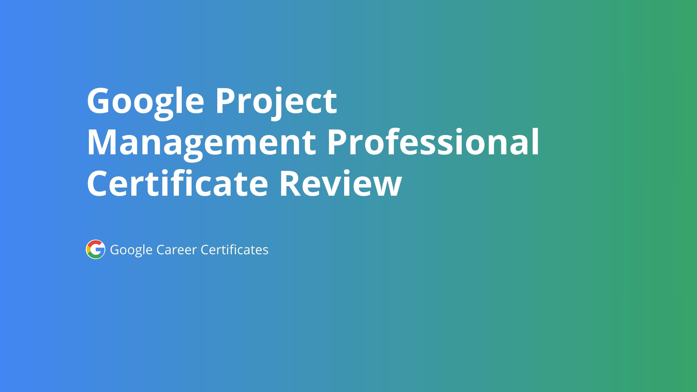

# Google Project Management Professional Certificate Notes
This is extensive study notes for [Google Project Management Professional Certificate on Coursera](https://www.coursera.org/professional-certificates/google-project-management) which I hope it will help anyone interested in project management or start this spectialization and need a reference to return back to whenever need to refresh some informations.

Start your path to a career in project management. In this program, you’ll learn in-demand skills that will have you job-ready in less than six months. No degree or experience is required.

### WHAT YOU WILL LEARN
- Gain an immersive understanding of the practices and skills needed to succeed in an entry-level project management role.
- Learn the foundations of Agile project management, with a focus on implementing Scrum events, building Scrum artifacts, and understanding Scrum roles
- Learn how to create effective project documentation and artifacts throughout the various phases of a project
- Practice strategic communication, problem-solving, and stakeholder management through real-world scenarios

### SKILLS YOU WILL GAIN
- Organizational Culture
- Career Development
- Strategic Thinking
- Change Management
- Project Management
- Stakeholder Management
- Business Writing
- Project Charter
- Project Planning
- Risk Management
- Task Estimation
- Procurement
### About this Professional Certificate
Prepare for a new career in the high-growth field of project management, no experience or degree required. Get professional training designed by Google and get on the fastrack to a competitively paid job. There are 479,000 U.S. job openings in project management with a $73,000 median entry-level salary.

**Project managers** are natural problem-solvers. They set the plan and guide teammates, and manage changes, risks, and stakeholders.

Gain in-demand skills that will prepare you for an entry-level job. Learn from Google employees whose foundations in project management served as launchpads for their own careers.

Upon completion, you can directly apply for jobs with Google and over 150 U.S. employers, including Walmart, Best Buy, and Astreya. 

This program qualifies you for over 100 hours of project management education, which helps prepare you for [Project Management Institute Certifications](https://www.pmi.org/) like the globally-recognized [Certified Associate in Project Management (CAPM)®](https://www.pmi.org/certifications/certified-associate-capm?utm_job_number=16&utm_campaign_name=capm_lead_generation&utm_region_name=north_america&utm_program_origin=planned_campaign&utm_program_type=continuous_campaign&utm_campaign_intent=acquisition&utm_funnel_stage=lead_acquisition&utm_initiative=certification&utm_product=capm&utm_marketing_channel=paid_media&utm_marketing_subchannel=search_ppc_nonbranded&utm_start_date=07012019&utm_end_date=12312030&utm_source=google&utm_custom_field_one=capm_certification_north_america&utm_custom_field_two=capm_certifiedassocinprojectmgmt&utm_custom_field_three=427370065638&utm_custom_field_four=certified%20associate%20in%20project%20management&utm_custom_field_five=e&gclid=CjwKCAiAkJKCBhAyEiwAKQBCkgwy-7haeOw1QrUjzLbGKtO4OgBW2EUgXGAKcvbs1nnFAhVj2n44RhoCsDIQAvD_BwE).

**75% of Google Career Certificate Graduates in the United States report an improvement in their career trajectory (e.g. new job or career, promotion or raise) within 6 months of certificate completion²**

Check out all Google Career Certificates [here](https://www.coursera.org/google-career-certificates).

### Applied Learning Project
This program includes over 140 hours of instruction and hundreds of practice-based assessments which will help you simulate real-world project management scenarios that are critical for success in the workplace.

The content is highly interactive and exclusively developed by Google employees with decades of experience in program and project management.

Skills you’ll gain will include: Creating risk management plans; Understanding process improvement techniques; Managing escalations, team dynamics, and stakeholders; Creating budgets and navigating procurement; Utilizing  project management software, tools, and templates; Practicing Agile project management, with an emphasis on Scrum.

Through a mix of videos, assessments, and hands-on activities, you’ll get introduced to initiating, planning, and running both traditional and Agile projects. You’ll develop a toolbox to demonstrate your understanding of key project management elements, including managing a schedule, budget, and team.

### There are 6 Courses in this Professional Certificate
1. [Foundations of Project Management](https://www.coursera.org/learn/project-management-foundations?specialization=google-project-management)
    This course is the first in a series of six to equip you with the skills you need to apply to introductory-level roles in project management. Project managers play a key role in leading, planning and implementing critical projects to help their organizations succeed. In this course, you’ll discover foundational project management terminology and gain a deeper understanding of  the role and responsibilities of a project manager. We’ll also introduce you to the kinds of jobs you might pursue after completing this program. Throughout the program, you’ll learn from current Google project managers, who can provide you with a multi-dimensional educational experience that will help you build your skills  for on-the-job application. 

    Learners who complete this program should be equipped to apply for introductory-level jobs as project managers. No previous experience is necessary.

    By the end of this course, you will be able to:
    - Define project management and describe what constitutes a project.
    - Explore project management roles and responsibilities across a variety of industries.
    - Detail the core skills that help a project manager be successful.
    - Describe the life cycle of a project and explain the significance of each phase.
    - Compare different program management methodologies and approaches and determine which is most effective for a given project.
    - Define organizational structure and culture and explain how it impacts project management. 
    - Define change management and describe the role of the project manager in the process.
2. [Project Initiation: Starting a Successful Project](https://www.coursera.org/learn/project-initiation-google?specialization=google-project-management)
    This is the second course in the Google Project Management Certificate program. This course will show you how to set a project up for success in the first phase of the project life cycle: the project initiation phase. In exploring the key components of this phase, you’ll learn how to define and manage project goals, deliverables, scope, and success criteria. You’ll discover how to use tools and templates like stakeholder analysis grids and project charters to help you set project expectations and communicate roles and responsibilities. Current Google project managers will continue to instruct and provide you with hands-on approaches for accomplishing these tasks while showing you the best project management tools and resources for the job at hand.

    Learners who complete this program should be equipped to apply for introductory-level jobs as project managers. No previous experience is necessary.

    By the end of this course, you will be able to: 
    - Understand the significance of the project initiation phase of the project life cycle. 
    - Describe the key components of the project initiation phase. 
    - Determine a project’s benefits and costs.
    - Define and create measurable project goals and deliverables. 
    - Define project scope and differentiate among tasks that are in-scope and out-of-scope. 
    - Understand how to manage scope creep to avoid impacting project goals.
    - Define and measure a project’s success criteria. 
    - Complete a stakeholder analysis and explain its significance.
    - Utilize RACI charts to define and communicate project team member responsibilities.
    - Understand the key components of project charters and develop a project charter for project initiation.
    - Evaluate various project management tools to meet project needs.
3. [Project Planning: Putting It All Together](https://www.coursera.org/learn/project-planning-google?specialization=google-project-management)
    This is the third course in the Google Project Management Certificate program. This course will explore how to map out a project in the second phase of the project life cycle: the project planning phase. You will examine the key components of a project plan, how to make accurate time estimates, and how to set milestones. Next, you will learn how to build and manage a budget and how the procurement processes work. Then, you will discover tools that can help you identify and manage different types of risk and how to use a risk management plan to communicate and resolve risks. Finally, you will explore how to draft and manage a communication plan and how to organize project documentation. Current Google project managers will continue to instruct and provide you with hands-on approaches for accomplishing these tasks while showing you the best project management tools and resources for the job at hand.

    Learners who complete this program should be equipped to apply for introductory-level jobs as project managers. No previous experience is necessary.

    By the end of this course, you will be able to: 
    - Describe the components of the project planning phase and their significance.
    - Explain why milestones are important and how to set them. 
    - Make accurate time estimates and describe techniques for acquiring them from team members.  
    - Identify tools and best practices to build a project plan and risk management plan. 
    - Describe how to estimate, track, and maintain a budget.
    - Explain the procurement process and identify key procurement documentation. 
    - Draft a communication plan and explain how to manage it.
    - Explain why milestones are important and how to set them. 
    - Explain why a project plan is necessary and what components it contains. 
    - Make accurate time estimates and describe techniques for acquiring them from team members.
4. [Project Execution: Running the Project](https://www.coursera.org/learn/project-execution-google?specialization=google-project-management)
    This is the fourth course in the Google Project Management Certificate program. This course will delve into the execution and closing phases of the project life cycle. You will learn what aspects of a project to track and how to track them. You will also learn how to effectively manage and communicate changes, dependencies, and risks. As you explore quality management, you will learn how to measure customer satisfaction and implement continuous improvement and process improvement techniques. Next, you will examine how to prioritize data, how to use data to inform your decision-making, and how to effectively present that data. Then, you will strengthen your leadership skills as you study the stages of team development and how to manage team dynamics. After that, you will discover tools that provide effective project team communication, how to organize and facilitate meetings, and how to effectively communicate project status updates. Finally, you will examine the steps of the project closing process and how to create and share project closing documentation. Current Google project managers will continue to instruct and provide you with hands-on approaches for accomplishing these tasks while showing you the best project management tools and resources for the job at hand.

    Learners who complete this program should be equipped to apply for introductory-level jobs as project managers. No previous experience is necessary.

    By the end of this course, you will be able to: 
    - Identify what aspects of a project to track and compare different tracking methods.
    - Discuss how to effectively manage and communicate changes, dependencies, and risks.
    - Explain the key quality management concepts of quality standards, quality planning, quality assurance, and quality control.
    - Describe how to create continuous improvement and process improvement and how to measure customer satisfaction.
    - Explain the purpose of a retrospective and describe how to conduct one. 
    - Demonstrate how to prioritize and analyze data and how to communicate a project’s data-informed story. 
    - Identify tools that provide effective project team communication and explore best practices for communicating project status updates.
    - Describe the steps of the closing process for stakeholders, the project team, and project managers.
5. [Agile Project Management](https://www.coursera.org/learn/agile-project-management?specialization=google-project-management)
    This is the fifth course in the Google Project Management Certificate program. This course will explore the history, approach, and philosophy of Agile project management, including the Scrum framework. You will learn how to differentiate and blend Agile and other project management approaches. As you progress through the course, you will learn more about Scrum, exploring its pillars and values and comparing essential Scrum team roles. You will discover how to build, manage, and refine a product backlog, implement Agile’s value-driven delivery strategies, and define a value roadmap. You will also learn strategies to effectively organize the five important Scrum events for a Scrum team, introduce an Agile or Scrum approach to an organization, and coach an Agile team. Finally, you will learn how to search for and land opportunities in Agile roles. Current Google project managers will continue to instruct and provide you with the hands-on approaches, tools, and resources to meet your goals.

    Learners who complete this program should be equipped to apply for introductory-level jobs as project managers. No previous experience is necessary.

    By the end of this course, you will be able to: 
    - Explain the Agile project management approach and philosophy, including values and principles.
    - Explain the pillars of Scrum and how they support Scrum values.
    - Identify and compare the essential roles in a Scrum team and what makes them effective.
    - Build and manage a Product Backlog and perform Backlog Refinement.
    - Describe the five important Scrum events and how to set up each event for a Scrum team.
    - Implement Agile’s value-driven delivery strategies and define a value roadmap.
    - Explain how to coach an Agile team and help them overcome challenges.
    - Conduct a job search for an Agile role and learn how to succeed in your interview.
6. [Capstone: Applying Project Management in the Real World](https://www.coursera.org/learn/applying-project-management?specialization=google-project-management)
    In this final, capstone course of the Google Project Management Certificate, you will practice applying the project management knowledge and skills you have learned so far. We encourage learners to complete Courses 1-5 before beginning the final course, as they provide the foundation necessary to complete the activities in this course. 

    As you progress through this course, you will “observe” a project manager in a real-world scenario and complete dozens of hands-on activities. You will:
    - analyze project documents to identify project requirements and evaluate stakeholders 
    - complete a project charter and use it as a tool to align project scope and goals among stakeholders
    - identify tasks and milestones and document and prioritize them in a project plan
    - define quality management standards and explore how to effectively share qualitative data
    - demonstrate your project’s impact through effective reporting 

    By the end of this course, you will have developed a portfolio of project management artifacts that will demonstrate the skills you have learned throughout the entire program, such as your ability to manage stakeholders and teams, organize plans, and communicate project details. These artifacts can exhibit your career readiness when applying for jobs in the field. To further prepare you to interview for project management jobs, you will reflect on past projects, develop an “elevator pitch,” and anticipate common interview questions. Current Google project managers will continue to instruct and provide you with the strategies, tools, and resources to meet your goals.

    After completing this program, you should be equipped to apply for introductory-level jobs as a project manager. You will also have the opportunity to claim a certification of completion badge that will be recognizable to employers.

# Table of Content
- [Course 1: Foundations of Project Management](#c1)
    - [Week 1: Embarking on a career in project management](#c1-w1)
        - [Getting started with the program](#c1-w1-getting-started)
        - [Understanding the basics of project management](#c1-w1-basics-pm)
        - [Learning about careers in project management](#c1-w1-pm-careers)
    - [Week 2: Becoming an effective project manager](#c1-w2)
        - [Exploring how a project manager adds value](#c1-w2-how-pm-add-value)
        - [Learning more about project manager roles](#c1-w2-pm-roles)
        - [Acquiring the core skilles of a successful project manager](#c1-w2-core-skills)
    - [Week 3: The project management life cycle and methodologies](#c1-w3)
        - [Understanding the project life cycle](#c1-w3-project-life-cycles)
        - [Analyzing the different project phases](#c1-w3-project-phases)
        - [Comparing project management life cycle and methodologies and approaches](#c1-w3-pm-methodologies)
    - [Week 4: Organizational structure and culture](#c1-w4)
        - [Understanding organizational structure](#c1-w4-org-structure)
        - [Understannding the impact of organizational culture](#c1-w4-org-culture)
        - [Understanding change management](#c1-w4-change-management)
        - [Optional - Pusuing your new career](#c1-w4-new-career)
- [Course 2: Project Initiation: Starting a Successful Project](#c2)
- [Course 3: Project Planning: Putting It All Together](#c3)
- [Course 4: Project Execution: Running the Project](#c4)
- [Course 5: Agile Project Management](#c5)
- [Course 3: Capstone: Applying Project Management in the Real World](#c6)

# Course 1: Foundations of Project Management 
## Week 1: Embarking on a career in project management 
You will learn how the program is structured, what project management is and what a project manager does, how to apply your skills from previous work experience to project management roles, what types of project management roles you could pursue after completing this certificate, and how to search for those positions.

**Learning Objectives**
- Relate the skills and responsibilities of a project manager necessary to achieve success on the job.
- Define project management and describe what constitutes a project.
- Explain project management roles and responsibilities across a variety of industries.
- Detail and relate project management skills to project management and its value to business.
- Determine how this program will help prepare you for a career in project management.
- Explain the Project Management certificate program structure and course functionality.
### Getting started with the program 
### Understanding the basics of project management 
### Learning about careers in project management 

## Week 2: Becoming an effective project manager 
You will learn how project managers add value to organizations and to their teams, what the role and responsibilities of a project manager entail, and what core skills a project manager needs to be successful.

**Learning Objectives**
- Detail the core skills to be a successful project manager.
- Describe the role and day-to-day responsibilities of a project manager.
- Discuss when and why it is necessary to have a project manager.

### Exploring how a project manager adds value 
### Learning more about project manager roles 
### Acquiring the core skilles of a successful project manager 

## Week 3: The project management life cycle and methodologies 
You will learn about the phases of the project life cycle, what tasks they involve, and why it is important to complete them. You will also learn about the different project management methodologies and approaches and which is most effective for a given project.

**Learning Objectives**
- Explain why it is important to understand and follow the life cycle of a project.
- Define and outline a project’s phases and each phase’s tasks.
- Compare different program management methodologies and determine which is most effective for a given project.

### Understanding the project life cycle 
### Analyzing the different project phases 
### Comparing project management life cycle and methodologies and approaches 

## Week 4: Organizational structure and culture 
You will learn about common organizational structures and how they impact project management, how organizational culture impacts project management, and how a project manager contributes to the change management process. Optionally, you can start to develop your strategy and professional network to help you prepare for your job search.

**Learning Objectives**
- Define change management and summarize its relationship to the project management role.
- Define organizational culture and explain how it impacts project management.
- Identify common types of organizational structures.
- Define organizational structure and explain how it impacts project management.

### Understanding organizational structure 
### Understannding the impact of organizational culture 
### Understanding change management 
### Optional - Pusuing your new career 